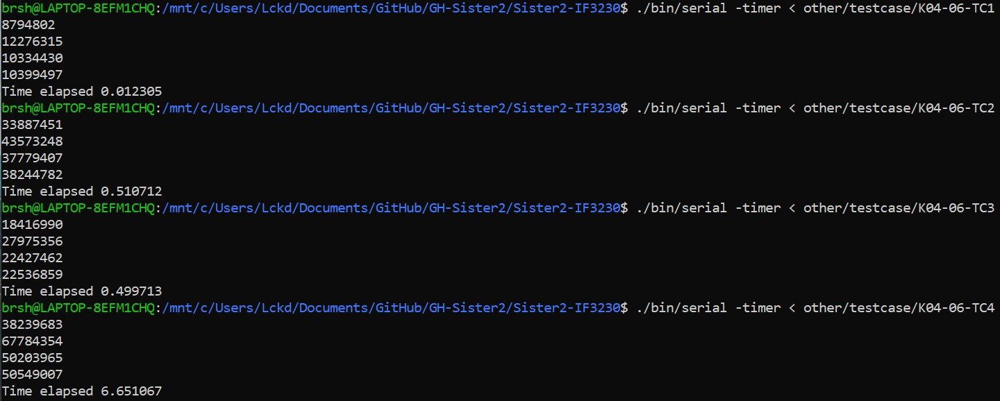
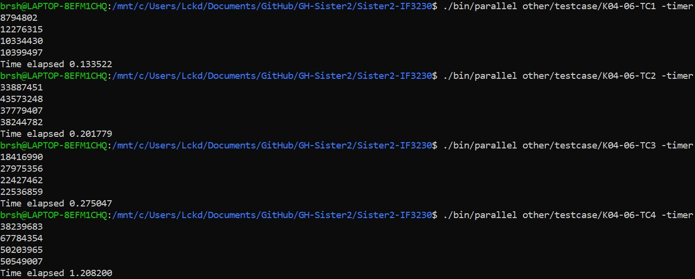

# Tugas Besar 2 - Sister
Catatan : Repository Gitlab IF merupakan mirror dari Repository private Github dengan menggunakan GitHub Action

## 1. Alur Paralelisasi Program
Inti algoritma program untuk konvolusi sama persis dengan program serial.
Seluruh fungsi non-main dan struct milik `serial.c` dipindahkan ke `serial_lib.c`.
Sesuai dengan spesifikasi, ketiga algoritma utama yang dieksekusi parallel adalah konvolusi, range calculation, dan sorting.
Berikut adalah alur program

1. Host akan melakukan pembacaan file dengan `ifstream`

2. Host akan menampung pembacaan sementara pada host memory dan mengcopy informasi menggunakan `cudaMemcpy` ke device

3. Konvolusi : Desain algoritma paralelisasi konvolusi adalah setiap block akan memproses konvolusi 1 matriks input. Ditentukan pada awal setiap block berukuran 16x16 thread. Setiap thread akan mengkalkulasikan nilai intermediet dengan pemanggilan `supression_op` hingga loop internal thread berhenti. Dipilih 16x16 thread block karena matriks input hanya memiliki ukuran maksimum 50x50 pada TC4 sehingga pembagian secara block mungkin terlalu besar untuk use case.

4. Range calculation : Ketika kalkulasi semua nilai intermediet selesai, `thread[0][0]` akan mengkalkulasikan nilai range pada matriks. Beberapa pertimbangan yang menyebabkan skema paralelisasi tersebut adalah : untuk menghindari permasalahan race condition antar thread, proses pencarian max-min tidak terlalu berat sehingga paralelisasi tingkat grid mungkin sudah cukup.

5. Sorting : Proses sorting menggunakan merge sort dengan bubble sort sebagai helper. Algoritma merge sort bertipe bottom-up yang berawal pada setiap thread. Sorting dilakukan pada 1 blok dan 256 thread. Setiap thread akan mendapatkan subarray dengan ukuran tertentu. Subarray kecil tersebut akan dilakukan sorting dengan bubble sort terlebih dahulu sebelum dilakukan merge sort. Sistem merging menggunakan sistem binary tree yang sama dengan implementasi pada tugas besar 1 menggunakan MPI. Hasil akhir akan diproses pada `thread[0]`.

6. Host melakukan pengcopyan hasil output sorted array `matrix_ranges` dan menampilkan hasil akhir.

## 2. Waktu Eksekusi Program dan Analisis
Testing dijalankan pada Ryzen 4800H (8c/16t) dan Laptop 1660ti 80W. Berikut adalah waktu eksekusi program serial dan paralel 

 \

Setelah dilakukan testing pada kedua program, pada umumnya program paralel lebih cepat pada test case ke 2, 3, dan 4. 

Salah satu poin yang dapat ditarik pada hasil eksekusi adalah overhead dari komunikasi I/O CUDA lebih rendah dibandingkan komunikasi I/O dari MPI. Setiap proses yang dijalankan MPI memiliki address space yang berbeda dan terisolasi oleh sistem operasi. Pada paralelisasi CUDA target matriks diletakkan pada global / device memory dan kernel matriks disimpan pada shared memory setiap block sehingga overhead utama I/O berasal dari pemindahan memory host-device. Overhead pemindahan memori antar host-device lebih rendah dibandingkan overhead untuk melakukan komunikasi antar proses yang setiap pemanggilannya membutuhkan pemanggilan sistem operasi lebih banyak.

Pada tugas besar 1, CPU thread diassign pada satu matriks sedangkan pada tugas besar 2 setiap GPU thread melakukan kalkulasi intermediet. CPU thread memiliki kecepatan (dalam metrik Hz) jauh lebih cepat dibandingkan GPU tetapi jumlah GPU thread jauh lebih banyak dibandingkan CPU thread. Pada permasalahan ini paralelisasi menggunakan GPU akan lebih cocok dikarenakan banyaknya permasalahan yang *embarassingly parallel*. Paralelisasi CPU akan lebih baik untuk kalkulasi yang membutuhkan kecepatan setiap eksekusinya dibandingkan jumlah problem size yang besar.

Hasil analisis tetap sama dengan hasil analisis pada tugas besar 1 yaitu paralelisasi menggunakan MPI. Program paralel akan lebih cepat jika overhead komunikasi lebih rendah dibandingkan pemrosesan algoritma. Test case 1 yang memiliki ukuran problem yang relatif kecil dieksekusi jauh lebih cepat pada CPU dibandingkan proses I/O memory antar host-device dan eksekusi pada device. Hal sebaliknya terjadi pada test case 2, 3, dan 4 dimana overhead I/O memory tidak terlalu besar dibandingkan processing time.

## 3. Analisis Perbedaan output Serial dan Paralel
Tidak ada perbedaan output pada hasil akhir kedua program.

## 4. Analisis studi kasus
Berikut adalah problem size yang diberikan pada studi kasus

1. Jumlah Matrix: 10000, Ukuran Kernel: 1x1, Ukuran Matrix: 1x1
2. Jumlah Matrix: 1, Ukuran Kernel: 1x1, Ukuran Matrix: 100x100
3. Jumlah Matrix: 1, Ukuran Kernel: 100x100, Ukuran Matrix: 100x100

Inti skema paralelisasi konvolusi yang digunakan adalah 1 block memproses 1 matriks dan 16x16 thread memproses pemanggilan `supression_op` yang menghasilkan intermediet. Dikarenakan hal tersebut kasus ke-2 mestinya lebih cepat dibandingkan kasus lain. 

Pada kasus ke-1 akan terdapat 10000 block yang setiap block 16x16 thread hanya 1x1 thread yang memproses kalkulasi. Pada kasus ke-2 hanya terdapat 1 block tetapi 16x16 thread akan bekerja untuk melakukan pemanggilan `supression_op` secara parallel. Pada kasus ke-3 terdapat 1 block dan 1 thread yang bekerja pada `supression_op` sehingga mestinya kasus ini akan berjalan paling lama dikarenakan GPU thread yang lambat.

Singkatnya berikut adalah penggunaan resource dari setiap kasus
1. Kasus 1 : 10000 block dan 1 thread
2. Kasus 2 : 1 block dan 16x16 thread
3. Kasus 3 : 1 block dan 1x1 thread

Jika overhead block lebih rendah dibandingkan thread, kasus pertama akan lebih cepat dibandingkan kasus kedua. Berikut adalah perkiraan peringkat kecepatan 

1. Kasus 2
2. Kasus 1
3. Kasus 3

## Referensi
1. https://docs.nvidia.com/cuda/cuda-c-programming-guide/index.html
2. https://developer.nvidia.com/blog/even-easier-introduction-cuda/
